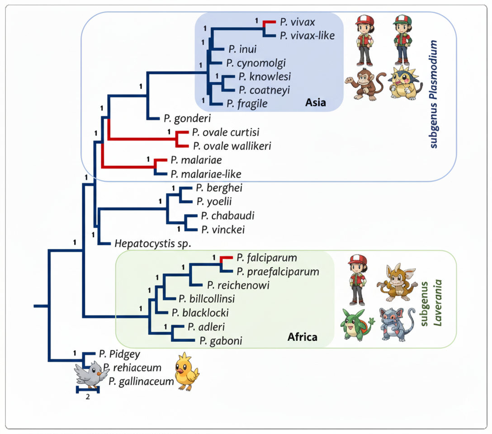

## My Research at Temple University

### A Tale of Two Clades: The Deep Evolutionary Divergence of Human Malarias

This review explains why the two main human malaria parasites, <i>P. vivax</i> and <i>P. falciparum</i>, are so biologically different. We show their distinct traits stem from a deep evolutionary split into two clades: subgenus <i>Plasmodium</i> and <i>Laverania</i>. My contribution was performing the phylogenomic reconstruction of the species tree from over 1,000 genes. This analysis provided the robust framework to visualize their ancient divergence and contextualize the unique molecular adaptations in each lineage. <a href="https://doi.org/10.1186/s12936-022-04130-9" target="_blank">[Publication]</a>

  

### Uncovering Hidden Parasite Diversity in Turtles Through Genomics

Standard genetic markers are often insufficient to identify species of <i>Haemogregarina</i> blood parasites in turtles. To solve this, our project developed novel mitochondrial markers. I executed the core bioinformatic pipeline, performing the <strong><i>de novo</i> assembly</strong> of the parasite's mitochondrial genome from raw sequencing reads after filtering out host data. This assembled genome served as the essential blueprint to design new primers, which successfully uncovered a vast, previously hidden genetic diversity. <a href="https://doi.org/10.1016/j.meegid.2021.105040" target="_blank">[Publication]</a>

