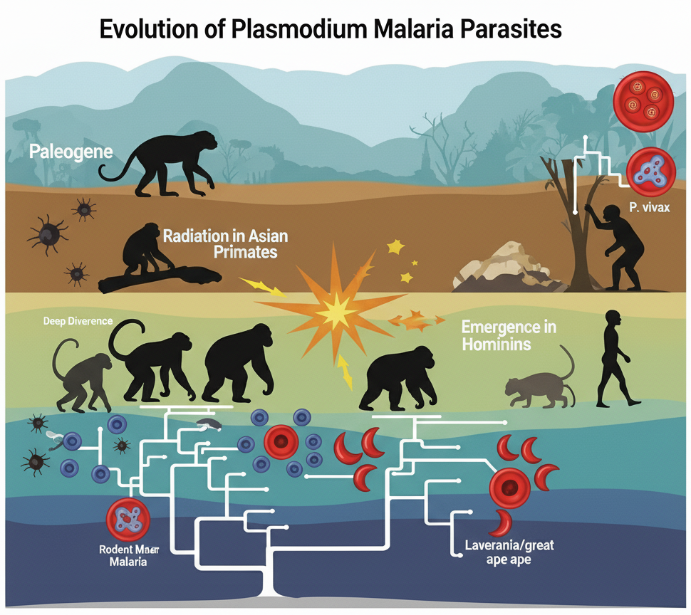
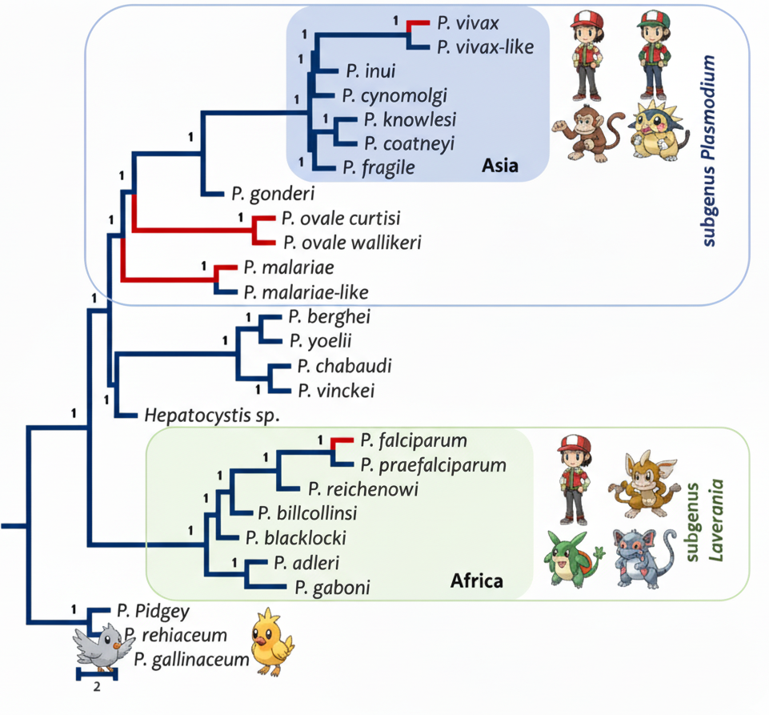

## My Research at Temple University

### A Machine Learning Pipeline for High-Throughput Sequencing of Malaria Parasites

Traditional DNA barcoding of malaria-like parasites often fails to detect complex co-infections and mixed-strain infections, limiting our understanding of their true biodiversity. To address this, we developed a new high-throughput sequencing protocol targeting the entire mitochondrial genome with PacBio HiFi long-reads. My primary contribution was the design and implementation of the <strong>HmtG-PacBio Pipeline</strong>, a novel bioinformatics workflow at the core of this method. This pipeline utilizes a <strong>machine learning model</strong> (a variational autoencoder) to process and automatically classify the long-read sequences, accurately sorting reads to identify distinct parasite haplotypes and species within a single complex sample. The method successfully characterized infections from diverse hosts—including birds, reptiles, and mammals—that were missed by standard techniques, providing a powerful and scalable new tool for biodiversity and population studies of haemosporidian parasites. <a href="https://doi.org/10.1186/s12936-022-04130-9" target="_blank">[Publication]</a>

  

### The Genome of an African Monkey Malaria Parasite Rewrites Evolutionary Timelines

As a central part of my doctoral research, I generated the first chromosome-level <strong><i>de novo</i> genome assembly</strong> for <i>Plasmodium gonderi</i>, a key malaria parasite of African monkeys. This high-quality genome served as a critical new resource to investigate the evolutionary origins of human malaria. My phylogenomic analyses placed the common ancestor of the human parasite <i>P. vivax</i> within the radiation of Asian primate malarias, strongly supporting an Asian origin for this widespread species. Furthermore, my time-tree analyses provided new estimates for major evolutionary events, dating the origin of the lethal <i>P. falciparum</i> clade to the same period as the radiation of its great ape hosts. <a href="https://doi.org/10.1186/s12936-022-04130-9" target="_blank">[Publication]</a>

  

### A Tale of Two Clades: The Deep Evolutionary Divergence of Human Malarias

This review explains why the two main human malaria parasites, <i>P. vivax</i> and <i>P. falciparum</i>, are so biologically different. We show their distinct traits stem from a deep evolutionary split into two clades: subgenus <i>Plasmodium</i> and <i>Laverania</i>. My contribution was performing the phylogenomic reconstruction of the species tree from over 1,028 genes. This analysis provided the robust framework to visualize their ancient divergence and contextualize the unique molecular adaptations in each lineage. <a href="https://doi.org/10.1186/s12936-022-04130-9" target="_blank">[Publication]</a>

  

### Uncovering Hidden Parasite Diversity in Turtles Through Genomics

Standard genetic markers are often insufficient to identify species of <i>Haemogregarina</i> blood parasites in turtles. To solve this, our project developed novel mitochondrial markers. I executed the core bioinformatic pipeline, performing the <strong><i>de novo</i> assembly</strong> of the parasite's mitochondrial genome from raw sequencing reads after filtering out host data. This assembled genome served as the essential blueprint to design new primers, which successfully uncovered a vast, previously hidden genetic diversity. <a href="https://doi.org/10.1016/j.meegid.2021.105040" target="_blank">[Publication]</a>

  

