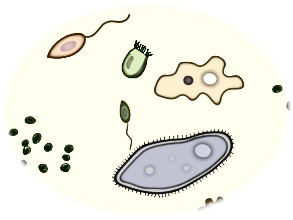

## My Research at National U. of Colombia

 

### Diversity of species of the phylum Apicomplexa in the wildlife.

 Hemoparasites are an important source of information about ecosystems since give us information about the natural history of the hosts, evolution, trophic relationships, emerging diseases and environmental health. The advances in molecular biology have promoted the detection of hemoparasites, and the number of lineages from them reported.  <a href="https://asgiraldoc.github.io/publications">1, 3</a>.

### *Haemoproteus columbae* apicoplast genome

  <i>Haemoproteus</i> shares a recent common ancestor with <i>Plasmodium</i> compared to other known Haemosporida such as the genus <i>Leucocytozoon</i>. In this sense, the <i>H. columbae</i> apicoplast genome is important since it can be used, for instance, in phylogenetic analyses as an outgroup for the <i>Plasmodium-Hepatocystis</i> clade. In addition to reporting the first <i>Haemoproteus</i> apicoplast genome, this new genome is used to reconstruct phylogenetic hypotheses within the order Haemosporida. <a href="https://asgiraldoc.github.io/publications">2</a>.

### Animal model and life cycle characterization of *Haemoproteus columbae*

  The main aims of this study were: i) to develop a useable methodology to carry out experimental research with <i>H. columbae</i> using its natural avian host (the Rock Pigeon) and its vector (louse fly) and ii) to follow the complete life cycle of <i>H. columbae</i> (cytb lineage HAECOL1) in experimentally infected insects and birds. <a href="https://asgiraldoc.github.io/publications">4</a>.

### Standardization of molecular biology protocols (heamoparasite diagnosis)

  This project succeeded in standardizing multiplex PCR assays to diagnose coinfections of heamoparasites that infect birds, achieving 79.4% of the total number of coinfections when confirmed host DNA integrity. It also provided preliminary results to increase the resolution of phylogenetic hypotheses using new mitochondrial markers. <a href="https://asgiraldoc.github.io/publications">5</a>.
 

