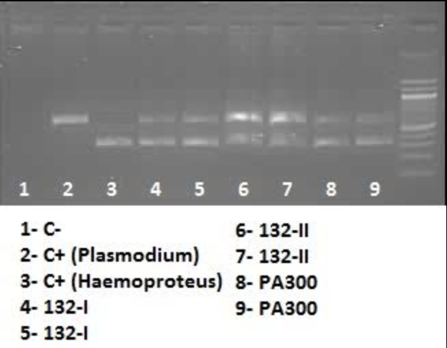
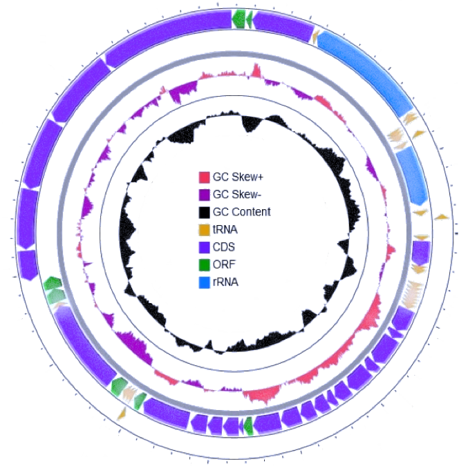

## My Research at UNAL

### 1. Standardization of molecular biology protocols (heamoparasite diagnosis)

This project succeeded in standardizing multiplex PCR assays to diagnose coinfections of heamoparasites that infect birds, achieving 79.4% of the total number of coinfections when confirmed host DNA integrity. It also provided preliminary results to increase the resolution of phylogenetic hypotheses using new mitochondrial markers.

### 2. Animal model and life cycle characterization of *Haemoproteus columbae*

The main aims of this study were: i) to develop a useable methodology to carry out experimental research with H. columbae using its natural avian host (the Rock Pigeon) and its vector (louse fly) and ii) to follow the complete life cycle of H. columbae (cytb lineage HAECOL1) in experimentally infected insects and birds.

### 3. *Haemoproteus columbae* apicoplast genome

