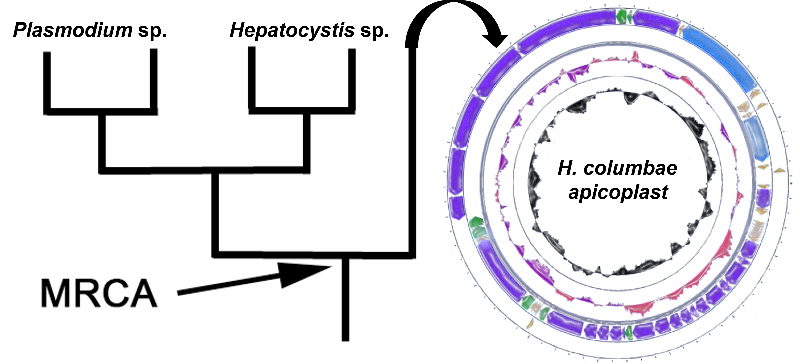

## My Research at UNAL

### 1. Standardization of molecular biology protocols (heamoparasite diagnosis)

This project succeeded in standardizing multiplex PCR assays to diagnose coinfections of heamoparasites that infect birds, achieving 79.4% of the total number of coinfections when confirmed host DNA integrity. It also provided preliminary results to increase the resolution of phylogenetic hypotheses using new mitochondrial markers.

### 2. Animal model and life cycle characterization of *Haemoproteus columbae*

### 3. *Haemoproteus columbae* genome

